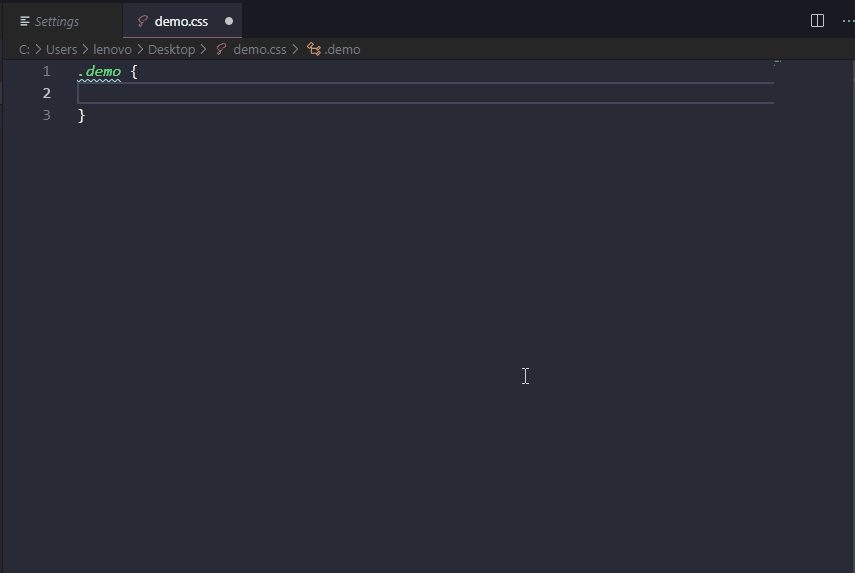

 

## px2xx

> 支持px转换vw、vh、rem以及自定义转换的提示插件

### 支持文件类型
* html
* vue
* css
* less
* scss
* sass
* stylus

如果非上述文件格式，可通过右下角`select language mode`选择上述任意一个格式，就可触发提示。

### 配置
可通过快捷键`Ctrl + ,`打开设置页面，搜索px2xx;

1. `width`，设计稿宽度，默认值`750`。用于转换vw、rem
2. `height`，设计稿高度，默认值`667`。用于转换vh
3. `toFixedNum`，小数点后保留位数，默认值`4`。
4. `customXX`，自定义提示项，默认值`1%xx`。格式为`rate%unit`，rate需为有效数字，unit为自定义的单位。如1%xx，4px可以通过计算(4*1)xx，最后出来结果就是4xx。